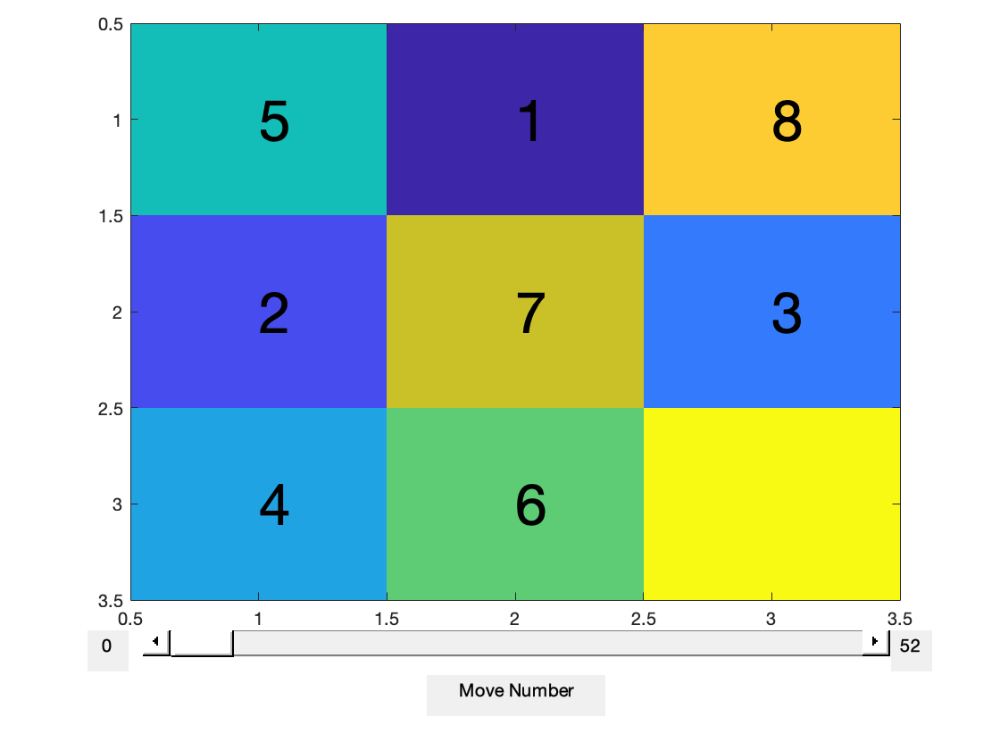

Solve Tile Puzzle (using A* Search)
===================================

The goal of this challenge is to solve a tile puzzle of arbitrary size using A* search.


*Figure 1: An example 3x3 tile puzzle, which has been scrambled.*

Your Task
---------
1. Clone this repository onto your machine
```shell
git clone git@github.com:zborffs/tile-puzzle-challenge.git
```

1. (Alternative) Select the green "Code" drop down and download the .zip of this repository.

2. Implement the A* search algorithm. Update the template 'utils/A_star_search.m'. Hint: Look at pseudocode in Wikipedia article (link below).

3. Come up with a heuristic cost function. Implement your function using the template 'utils/heuristic_cost.m'.

4. Run 'test_soln.m' to test whether your A* search algorithm solves the problem. Update the "dimension" parameter to solve problems of arbitrary dimension (restrict yourself to dimension < 10 for speed).

5. Run 'visualize_soln.m' to generate a visualization of your algorithm solving a random board. Update the "dimension" parameter to solve problems of arbitrary dimension (restrict yourself to dimension < 5 so you can easily click through individual moves). Update the "rng_seed" parameter to generate new problems to solve.

Motivation
----------
Solving a tile puzzle is analogous to routing Amazon warehouse robots out of traffic jams. 

We can learn about how A* search works by implementing it in code. Learning how A* search works may provide insight into the development of new search algorithms. 

We may also discover ways of measuring the *performance* of an arbitrary search algorithm, by first implementing a well-known algorithm like A*. If we develop a new algorithm later, we may test its measured performance against that of A* to determine in what ways our new algorithm is better or worse at solving the problem.

Resources
---------
1. [Computerphile: A* Search](https://www.youtube.com/watch?v=ySN5Wnu88nE) - Good high-level understanding of A* search.
2. [Wikipedia](https://en.wikipedia.org/wiki/A*_search_algorithm) - Good in-depth description of what the algorithm does and how it works. Hint: Look at pseudocode!
3. [Brilliant.org](https://brilliant.org/wiki/a-star-search/) - Good high-level / low-level description of A* search
4. [slidingtiles.com](https://slidingtiles.com/en/puzzle/play/art/25367-3x3-puzzle#3x3) - Fun website for solving these puzzles on your own.
